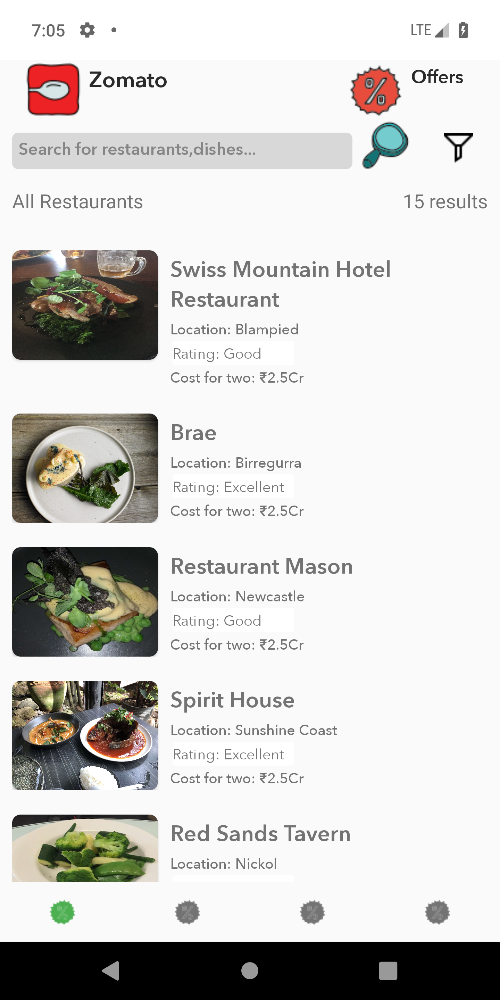

# LiveLikeProject
Android application build with MVVM Pattern, using Zomato API to enable search cities arround the world and display restaurants with location,cost for two and ratings. You can sort the results by cost and filter it by count .

